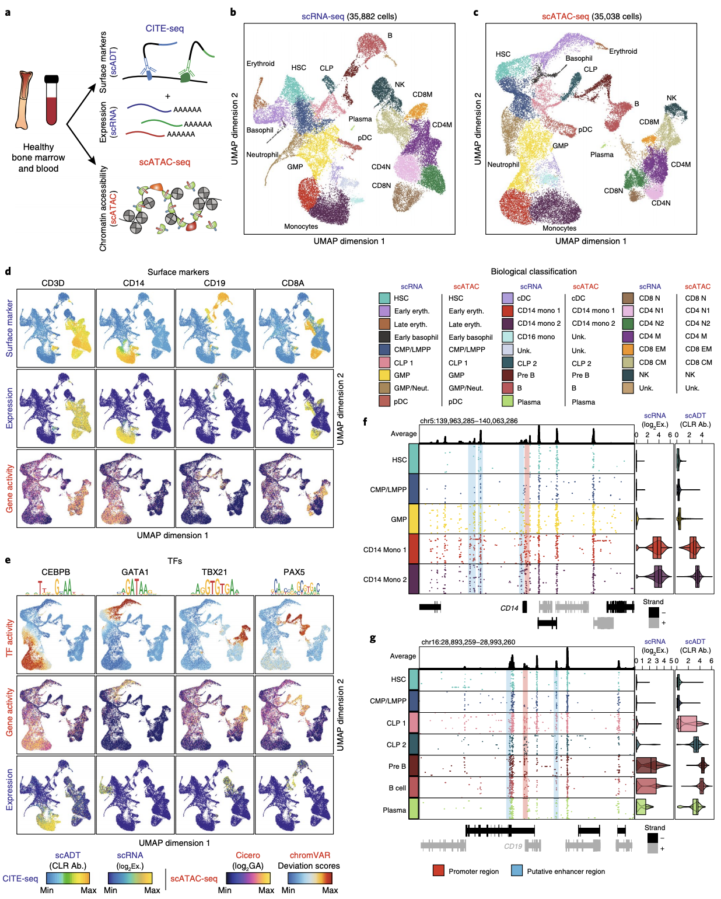

# Single-cell multiomic analysis identifies regulatory programs in mixed-phenotype acute leukemia. Nature Biotechnology (Granja JM*, Klemm SK*, McGinnis LM*, et al. 2019)

## **Link** : https://www.nature.com/articles/s41587-019-0332-7

## Please cite : Granja JM et al., Single-cell multiomic analysis identifies regulatory programs in mixed-phenotype acute leukemia. Nature Biotechnology (2019)  

# Brief Descriptions of Analysis Scripts

## scATAC Analyses

**scATAC_01** - Script for reading in 10x scATAC-seq fragments identify cells using number of fragments and TSS enrichment scores and saving fitlered fragments.

**scATAC_02** - Script for pre-clustering using large windows genome-wide and then calling peaks on putative clusters and create a master peak set

**scATAC_03** - LSI-Clustering + UMAP of scATAC-seq data with visualization and demonstration of how to properly save
umap for projection.

**scATAC_04** - Computing Gene Activity Scores using an adapted form of Cicero (Pliner et al 2018).

**scATAC_05** - Identifying potential disease cells by clustering disease w/ healthy reference, and then projecting these
cells onto healthy hematopoiesis.

## scRNA Analyses

**scRNA_01** - LSI-Clustering + UMAP of scRNA-seq data with visualization and demonstration of how to properly save
umap for projection.

**scRNA_02** - Identifying potential disease cells by clustering disease w/ healthy reference, and then projecting these
cells onto healthy hematopoiesis.

## Integration (scATAC + scRNA) Analyses

**scRNA_scATAC_Integration_01** - Alignment of scRNA and scATAC-seq data using Seurat CCA and identifcation of nearest
neighbors across modalities.

**scRNA_scATAC_Integration_02** - Aggregate scRNA + scATAC-seq data for correlation focused analysis.

**scRNA_scATAC_Integration_03** - Identify putative Peak-To-Gene Links with aligned scATAC and scRNA-seq data aggregates.

**scRNA_scATAC_Integration_04** - Link TFs to putative target genes that are differential in both mRNA and nearby accessibility peaks containing motifs of the TFs.

# Raw Data Download

### GEO Accession : GSE139369 https://www.ncbi.nlm.nih.gov/geo/query/acc.cgi?acc=GSE139369  

### You will be able to download raw 10x Bam Files which can be converted back to fastq using bamtofastq (https://support.10xgenomics.com/docs/bamtofastq) if you have issues with this please reach out to support@10xgenomics  

### scATAC-seq fragment files which contain fragment coordinates

### scRNA-seq/scADT-seq individual matrices (recommend looking below for summarized experiments)

# Additional Data Download Links

### These links may be moved if we can find a better host for better download speed

## Notes

**.rds** file is an R binarized object to read into R use readRDS(filename)

**SummarizedExperiment** is a class in R see :  https://bioconductor.org/packages/release/bioc/html/SummarizedExperiment.html

**deviations** (TF chromVAR) is a class in R see :  https://bioconductor.org/packages/release/bioc/html/chromVAR.html

## Healthy Hematopoiesis

**scATAC-seq Hematopoeisis cell x peak Summarized Experiment** :  https://jeffgranja.s3.amazonaws.com/MPAL-10x/Supplementary_Data/Healthy-Data/scATAC-Healthy-Hematopoiesis-191120.rds

**scATAC-seq Hematopoeisis cell x gene activity Summarized Experiment** :  https://jeffgranja.s3.amazonaws.com/MPAL-10x/Supplementary_Data/Healthy-Data/scATAC-Cicero-GA-Hematopoiesis-191120.rds

**scATAC-seq Hematopoeisis cell x TF chromVAR Summarized Experiment** :  https://jeffgranja.s3.amazonaws.com/MPAL-10x/Supplementary_Data/Healthy-Data/scATAC-chromVAR-Hematopoiesis-191120.rds

**scRNA-seq Hematopoeisis cell x gene Summarized Experiment** :  https://jeffgranja.s3.amazonaws.com/MPAL-10x/Supplementary_Data/Healthy-Data/scATAC-Cicero-GA-Hematopoiesis-191120.rds

**scADT-seq Hematopoeisis cell x antibody Summarized Experiment** :  https://jeffgranja.s3.amazonaws.com/MPAL-10x/Supplementary_Data/Healthy-Data/scADT-Healthy-Hematopoiesis-191120.rds

**Note 1.** If you want to get the biological classifications for each cell use colData(se)$BioClassification.

## Healthy + MPAL Data Sets

**scATAC-seq Hematopoeisis + MPAL cell x peak Summarized Experiment** :  

**scATAC-seq Hematopoeisis + MPAL cell x gene activity Summarized Experiment** :  

**scATAC-seq Hematopoeisis + MPAL cell x TF chromVAR Summarized Experiment** :  

**scRNA-seq Hematopoeisis + MPAL cell x gene Summarized Experiment** :  

**scADT-seq Hematopoeisis + MPAL cell x antibody Summarized Experiment** :  

**Note 1.** The peakset for Hematopoiesis + MPAL is different than that for Hematopoiesis because we used the same peak calling pipeline where pre-clustering was done using all the cells (ie Hematopoiesis + MPAL) then peaks called so that we could easily include malignant peaks. This did not result in many ~10-20% additional peaks, but they may not be the exact coordinates as in the previous file.

**Note 2.** If you want to get projected positions/classifications for MPALs onto hematopoiesis use colData(se)$ProjectedUMAP1, colData(se)$ProjectedUMAP2, and  colData(se)$ProjectedClassification.

## LSI-Projection 

**scATAC-seq saved UMAP embedding** :  https://jeffgranja.s3.amazonaws.com/MPAL-10x/Supplementary_Data/LSI-Projection/scATAC-Projection-UMAP.zip

**scRNA-seq saved UMAP embedding** :  https://jeffgranja.s3.amazonaws.com/MPAL-10x/Supplementary_Data/LSI-Projection/scRNA-Projection-UMAP.zip

**Note 1.** To project into the reference hematopoiesis we used in this paper you need to use the uwot.tar file for either modality.

## Integration

**Peak-To-Gene Linkages** :  https://jeffgranja.s3.amazonaws.com/MPAL-10x/Supplementary_Data/Integration/MPAL-Significant-Peak2Gene-Links.tsv.gz

**scRNA to scATAC mappings** :  https://jeffgranja.s3.amazonaws.com/MPAL-10x/Supplementary_Data/Integration/scATAC-scRNA-mappings.rds

## Other

**MPAL Clinical FACS Data** :  https://jeffgranja.s3.amazonaws.com/MPAL-10x/Supplementary_Data_Revision_MPAL_FACS_FCS.zip

**Differential Results MPAL (scRNA + scATAC)** :  https://jeffgranja.s3.amazonaws.com/MPAL-10x/Supplementary_Data/LSI-Projection/MPAL-Differential-Results.zip

**Differential Results AML (scRNA)** :  https://jeffgranja.s3.amazonaws.com/MPAL-10x/Supplementary_Data/LSI-Projection/scRNA-AML-Analyses.zip

**Differential Results Bulk Leuekemias (bulk RNA)** :  https://jeffgranja.s3.amazonaws.com/MPAL-10x/Supplementary_Data/LSI-Projection/Bulk-Leukemias-RNA-Differential-Results.zip

